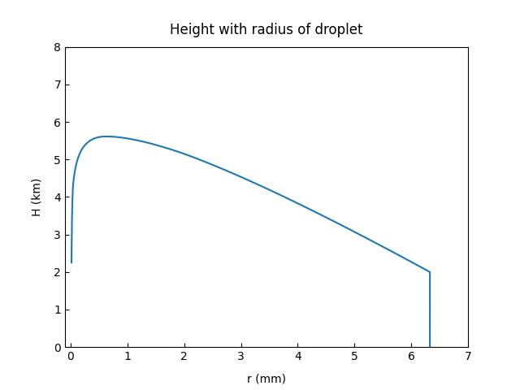
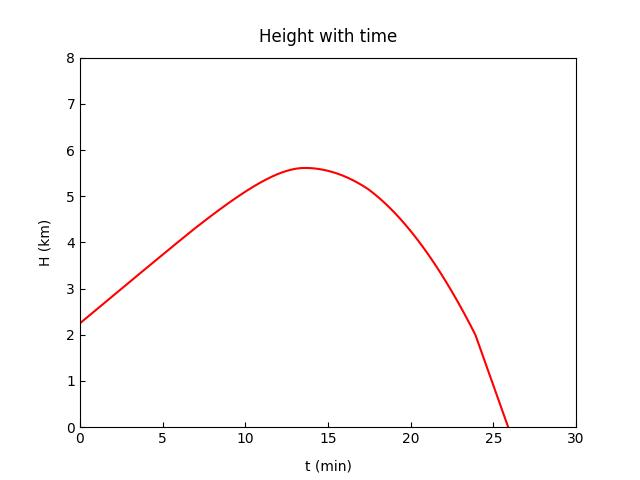
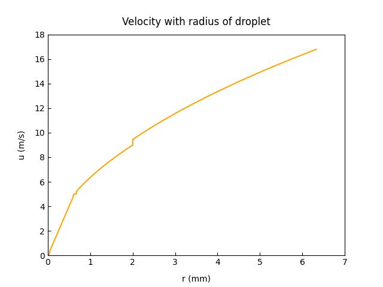
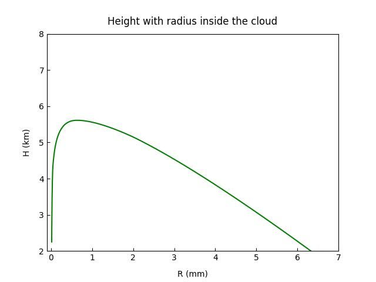

# Cloud Physics Droplet Simulation

This project simulates the complete lifecycle of a cloud droplet:
1. **Ascent**: Rising through the cloud due to updrafts, growing by collection/coalescence.
2. **Descent**: Falling through the cloud after becoming too heavy for the updraft.
3. **Precipitation**: Falling from the cloud base to the ground, subject to evaporation.

## Physics Model
The simulation involves several physical processes:
- **Terminal Velocity**: Calculated based on droplet radius regimes (Stokes, Intermediate, Turbulent).
- **Growth**: Droplets grow efficiently by collision-coalescence calculated via collection efficiencies.
- **Evaporation**: Below the cloud base, droplets shrink due to evaporation in subsaturated air.

## Installation

Ensure you have Python 3 installed along with the required scientific libraries:

```bash
pip install numpy matplotlib
```

## Usage

Run the main simulation script:

```bash
python3 cloud_physics_project.py
```

The script will:
- Simulate the trajectory of a droplet.
- Print key statistics (max height, time in cloud, size at ground) to the console.
- Generate and save visualization plots in the current directory.

## Simulation Outputs

### 1. Droplet Trajectory (Height vs Radius)
Shows the path of the droplet as it rises (grows) and falls.


### 2. Time Evolution
Tracks the altitude of the droplet over time.


### 3. Dynamics (Velocity vs Radius)
Illustrates how terminal velocity increases as the droplet grows.


### 4. Cloud Phase Detail
Focuses on the growth phase within the cloud boundaries.


## Code Structure

- `cloud_physics_project.py`: Main simulation class `CloudDropletSimulation`.
    - `PhysicsConstants`: Dataclass containing physical parameters (LWC, densities, constants).
    - `run()`: Executes the three phases of the droplet life.
    - `save_plots()`: Generates analysis figures.

## License
[MIT](LICENSE.md)
